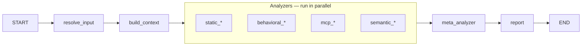

# Skillspector Development Guide

This guide helps developers understand, run, test, and extend the LangGraph-based skillspector workflow.

---

## 1. Overview

**skillspector** is a LangGraph workflow that scans a skill directory (or zip) and produces a SARIF 2.1.0 report, risk score, and formatted output (terminal, JSON, Markdown, or SARIF). It is the graph/engine for security analysis of AI agent skills.

**Entry points** are:

- **CLI** — run `skillspector scan <path-or-url>` (supports Git URL, file URL, .zip, .md file, or directory). Use `--format terminal|json|markdown|sarif`, `--output FILE`, `--no-llm`. See `skillspector --help`.
- **LangGraph dev server** — run `make langgraph-dev` to start the dev server and open **LangGraph Studio** in your browser. In Studio you can view the graph and run it with custom inputs (e.g. `skill_path`, `output_format`, `use_llm`).
- **Programmatic** — `from skillspector import graph` and call `graph.invoke(...)` or `graph.stream(...)`.

**Data flow (one sentence):** `resolve_input` (input_path or skill_path → `skill_path`, optional `temp_dir_for_cleanup`) → build context → parallel analyzers → meta_analyzer (LLM filter/enrich when `use_llm` is True) → report (SARIF + risk score + `report_body` from `output_format`). Caller cleans up `temp_dir_for_cleanup` after invoke when set.

---

## 2. Prerequisites and setup

**To get started:** create and activate a virtual environment, then install. All Makefile targets assume the venv is already created and activated.

```bash
# Create venv (use either uv or Python)
uv venv .venv
# or: python3 -m venv .venv

source .venv/bin/activate   # On Windows: .venv\Scripts\activate

make install-dev
```

- **Python**: 3.12+ (see [pyproject.toml](../pyproject.toml)). `make install` and `make install-dev` use **uv** if available (`uv sync` / `uv sync --all-extras`), otherwise **pip** (`pip install -e .` / `pip install -e ".[dev]"`). You must create and activate the virtual environment yourself before running any make target.
- **Environment**: Optional `.env` in the project root. The LangGraph dev server loads it (see [langgraph.json](../langgraph.json) `"env": ".env"`). Key variables:
  - **`SKILLSPECTOR_PROVIDER`**: Selects the active LLM provider — `openai`, `anthropic`, or `nv_build`. Defaults to `nv_build` when unset.
  - **Provider credential**: depends on the active provider — `NVIDIA_INFERENCE_KEY` (NVIDIA), `OPENAI_API_KEY` (OpenAI), or `ANTHROPIC_API_KEY` (Anthropic). See [llm_utils.py](../src/skillspector/llm_utils.py).
  - **`OPENAI_BASE_URL`**: Override the OpenAI endpoint (e.g. point at Ollama).
  - **`SKILLSPECTOR_MODEL`**: Override default model; see [constants.py](../src/skillspector/constants.py).

- **Logging**: Internal/operational logging uses the stdlib `logging` module. User-facing output (report body, errors, progress) uses Rich `console.print()`.
  - **Env**: `SKILLSPECTOR_LOG_LEVEL` (DEBUG, INFO, WARNING, ERROR). Default is `"WARNING"` (defined in [constants.py](../src/skillspector/constants.py)).
  - **CLI**: `--verbose` / `-V` sets internal logging to DEBUG for that run.
  - **In code**: `from skillspector.logging_config import get_logger; logger = get_logger(__name__)`.

---

## 3. Make targets

All targets assume the virtual environment is **already created and activated**. See [Makefile](../Makefile) for the full list.

| Target | Description |
|--------|-------------|
| `make help` | Show available targets |
| `make install` | Install the package in production mode |
| `make install-dev` | Install the package with development dependencies |
| `make langgraph-dev` | Run LangGraph dev server (opens Studio at `LANGGRAPH_STUDIO_URL`) |
| `make test` | Run tests |
| `make test-cov` | Run tests with coverage report (HTML + terminal) |
| `make lint` | Run linters (ruff only) |
| `make format` | Format code with ruff (check + fix, then format) |
| `make clean` | Remove build artifacts and cache files |
| `make build` | Build the package |

---

## 4. Architecture and graph structure

### State

[state.py](../src/skillspector/state.py) defines **`SkillspectorState`** (TypedDict, `total=False`). Key fields:

| Field | Description |
|-------|-------------|
| `input_path` | Raw input (URL, zip path, file path, or directory); consumed by resolve_input |
| `skill_path` | Resolved local directory path (set by resolve_input) |
| `temp_dir_for_cleanup` | Set by resolve_input when URL/zip/file was resolved; caller must clean up after invoke |
| `zip_bytes`, `mode` | Optional zip input and scan mode |
| `components` | List of relative file paths in the skill |
| `file_cache` | Map of path → file contents |
| `ast_cache` | Map of path → AST representation (for future use) |
| `manifest`, `previous_manifest` | Parsed skill metadata (e.g. from SKILL.md) |
| `component_metadata` | List of dicts: path, type, lines, executable, size_bytes (from build_context) |
| `has_executable_scripts` | True if any component has executable extension (e.g. .py, .sh); used for risk multiplier |
| `output_format` | Requested report format: `terminal`, `json`, `markdown`, or `sarif` |
| `report_body` | Formatted report string (set by report node from `output_format`) |
| `use_llm` | When False, meta_analyzer skips LLM and uses fallback (e.g. for `--no-llm`) |
| `findings` | All raw findings from analyzers (reducer: `operator.add`) |
| `filtered_findings` | Findings after meta_analyzer |
| `model_config` | Optional model IDs per node (e.g. default, meta_analyzer) |
| `risk_severity` | Severity band from risk score: LOW, MEDIUM, HIGH, CRITICAL |
| `risk_recommendation` | SAFE, CAUTION, or DO_NOT_INSTALL (from report node) |
| `sarif_report` | Final SARIF 2.1.0 dict |
| `risk_score` | Numeric risk score (0–100) |

### Graph

The graph is built in [graph.py](../src/skillspector/graph.py) via **`create_graph()`** and exposed as **`graph`** from the package ([__init__.py](../src/skillspector/__init__.py)).

### Flow diagram



There are no conditional edges: after `resolve_input` → `build_context`, all analyzer nodes run in parallel (fan-out); they all feed into `meta_analyzer` (fan-in), then `report` → `END`.

### Nodes

| Node | Role | Source |
|------|------|--------|
| **resolve_input** | Consumes `input_path` or `skill_path`; resolves URLs/zips/files via InputHandler; sets `skill_path` and (when needed) `temp_dir_for_cleanup` | [resolve_input.py](../src/skillspector/nodes/resolve_input.py) |
| **build_context** | Reads `skill_path`, populates `components`, `file_cache`, `ast_cache`, `manifest`, `component_metadata`, `has_executable_scripts` | [build_context.py](../src/skillspector/nodes/build_context.py) |
| **Analyzers** | 20 nodes; each returns `AnalyzerNodeResponse` (list of `Finding`). State reducer appends to `findings`. | [nodes/analyzers/__init__.py](../src/skillspector/nodes/analyzers/__init__.py) (`ANALYZER_NODE_IDS`, `ANALYZER_NODES`) |
| **meta_analyzer** | Per-file LLM filter/enrich of `findings` → `filtered_findings` via `LLMMetaAnalyzer`; one LLM call per file (or per chunk for oversized files); token budgets from `constants.py`; falls back when `use_llm` is False | [meta_analyzer.py](../src/skillspector/nodes/meta_analyzer.py), [llm_analyzer_base.py](../src/skillspector/nodes/llm_analyzer_base.py) |
| **report** | Builds SARIF 2.1.0, computes `risk_score`, `risk_severity`, `risk_recommendation`; writes `report_body` from `output_format` (terminal/json/markdown/sarif) | [report.py](../src/skillspector/nodes/report.py) |

---

## 5. Package layout

| Path | Purpose |
|------|---------|
| **Root** | |
| `graph.py` | Builds and compiles the LangGraph workflow |
| `state.py` | `SkillspectorState`, `AnalyzerNodeResponse`, `MetaAnalyzerResponse` |
| `models.py` | `Finding`, `AnalyzerFinding`, `Location`, `Severity`, `AnalyzerPlugin` |
| `constants.py` | Env-driven config: inference URL, default model, `MODELS` dict, token budgets (`get_max_input_tokens`, `get_max_output_tokens`) |
| `llm_utils.py` | `chat_completion()` for OpenAI-compatible / NVIDIA Inference API |
| `cli.py` | Typer app: `scan` (with input resolution, `--format`, `--no-llm`), `--version` |
| `input_handler.py` | Resolves Git URL, file URL, .zip, single file, or directory to a local directory path |
| `__init__.py` | Package version (from pyproject.toml via `importlib.metadata`) |
| `sarif_models.py` | SARIF 2.1.0 Pydantic models and `validate_sarif_report()` |
| **nodes/** | |
| `build_context.py` | Build-context node |
| `llm_analyzer_base.py` | Base LLM analyzer with per-file/per-chunk batching (`LLMAnalyzerBase`, `LLMMetaAnalyzer`, `Batch`) |
| `meta_analyzer.py` | Meta-analyzer node (uses `LLMMetaAnalyzer` for per-file LLM calls) |
| `report.py` | Report node |
| **nodes/analyzers/** | |
| `__init__.py` | Registry: `ANALYZER_NODE_IDS`, `ANALYZER_NODES` |
| `common.py` | Shared analyzer helpers (line/context extraction, AST name resolution) |
| `static_runner.py` | Runs static patterns; converts `AnalyzerFinding` → `Finding` |
| `pattern_defaults.py` | Shared pattern metadata (category, explanation, remediation) |
| `static_yara.py` | YARA-based static analyzer |
| `osv_client.py` | OSV.dev API client for live vulnerability lookups (SC4); batch queries with caching and fallback |
| `static_patterns_*.py` | 11 pattern-based analyzers (prompt_injection, data_exfiltration, etc.) |
| `behavioral_ast.py` | AST-based behavioral analyzer (AST1–AST8): detects exec, eval, subprocess, os.system, compile, dynamic import/getattr, and dangerous execution chains |
| `behavioral_taint_tracking.py` | Taint-tracking behavioral analyzer (TT1–TT5): source→sink data-flow analysis over Python AST |
| `mcp_least_privilege.py`, `mcp_tool_poisoning.py` | MCP analyzers (LP1–LP4 least-privilege; TP1–TP4 tool poisoning) |
| `mcp_rug_pull.py` | MCP rug-pull analyzer (stub; RP1–RP3 planned) |
| `semantic_security_discovery.py`, `semantic_developer_intent.py`, `semantic_quality_policy.py` | Semantic (LLM) analyzers; emit findings only when `use_llm` is enabled |

---

## 6. Running the workflow

### LangGraph dev server (primary for development)

Running `make langgraph-dev` starts the LangGraph dev server and opens **LangGraph Studio** in your browser (the Studio URL is configurable via the `LANGGRAPH_STUDIO_URL` variable in the [Makefile](../Makefile); defaults to public LangSmith). In Studio you can:

- **View the graph** — See the workflow as a diagram: nodes (resolve_input, build_context, analyzers, meta_analyzer, report) and edges. Useful for understanding flow and debugging.
- **Run the graph interactively** — Select the `skillspector_scan` graph, provide an input (e.g. `{"input_path": "/path/to/your/skill"}` or `{"skill_path": "/path/to/your/skill"}`), and execute a run. You can inspect state after each step and see the final `sarif_report` and `risk_score`.

**Setup**: [langgraph.json](../langgraph.json) defines the graph `skillspector_scan` at `./src/skillspector/graph.py:graph` and loads `.env`. Provide **`input_path`** (URL, zip, file, or directory) or **`skill_path`** (local directory). If the graph resolves a URL/zip/file, it sets `temp_dir_for_cleanup`; the caller should clean up that directory after invoke.

### CLI

After creating/activating the venv and running `make install-dev` (or `pip install -e ".[dev]"`), the **skillspector** CLI is available:

```bash
skillspector scan ./my-skill/                    # terminal output
skillspector scan ./my-skill/ --format json -o report.json
skillspector scan https://github.com/user/repo   # Git URL (clones to temp dir)
skillspector scan ./skill.zip --no-llm          # static analysis only
skillspector --version
```

The CLI passes `input_path` to the graph. The **resolve_input** node (using [input_handler.py](../src/skillspector/input_handler.py)) resolves Git URL, file URL, .zip, single .md file, or directory to a local directory and sets `skill_path` (and `temp_dir_for_cleanup` when a temp dir was created). The CLI cleans up `temp_dir_for_cleanup` after invoke. Exit code 1 if risk_score > 50; exit code 2 on error. See [Integrating SkillSpector](../README.md#integrating-skillspector) for the full exit-code and JSON contract.

### Programmatic

```python
from skillspector import graph

result = graph.invoke({
    "input_path": "/path/to/skill",  # or use "skill_path" for a local dir
    "output_format": "json",   # optional: terminal, json, markdown, sarif (default sarif)
    "use_llm": True,           # optional: False to skip LLM in meta_analyzer
})
# Or: graph.stream(...)
```

Optional state keys: `mode`, `model_config`, `output_format`, `use_llm`. The result includes `findings`, `filtered_findings`, `sarif_report`, `risk_score`, `risk_severity`, `risk_recommendation`, and `report_body` (formatted string for the requested `output_format`).

---

## 7. Testing

- **Location**:
  - [tests/unit/](../tests/unit/): `test_cli.py`, `test_input_handler.py`, `test_patterns.py`, `test_sarif.py`
  - [tests/integration/](../tests/integration/): `test_graph.py`, `test_graph_scanner.py`, `test_meta_analyzer_use_llm.py`
  - [tests/nodes/](../tests/nodes/): `test_build_context.py`, `test_resolve_input.py`, `test_report.py`, `test_llm_analyzer_base.py`
  - [tests/nodes/analyzers/](../tests/nodes/analyzers/): analyzer tests (`test_registry.py`, `test_static_patterns.py`)
- **Commands**: `make test`, `make test-cov`.
- **Key tests**: [test_graph.py](../tests/integration/test_graph.py) invokes the graph and asserts `findings`, `sarif_report`, `risk_score`, `report_body`; [test_input_handler.py](../tests/unit/test_input_handler.py) covers directory, zip, and single-file resolution; [test_resolve_input.py](../tests/nodes/test_resolve_input.py) covers the resolve_input node; [test_build_context.py](../tests/nodes/test_build_context.py) asserts `component_metadata` and `has_executable_scripts`.

---

## 8. Data models

- **Finding** ([models.py](../src/skillspector/models.py)): `rule_id`, `message`, `severity`, `confidence`, `file`, `start_line`, `end_line`, `category`, `pattern`, `finding`, `explanation`, `remediation`, `code_snippet`, `intent`, `tags`, `context`, `matched_text`. This is the type stored in state and used in SARIF and JSON report output.
- **AnalyzerFinding**: Analyzer-facing type with `Location` and `Severity` enum. Convert to `Finding` via [static_runner.analyzer_finding_to_finding](../src/skillspector/nodes/analyzers/static_runner.py) (or equivalent).
- **SARIF**: [sarif_models.py](../src/skillspector/sarif_models.py) provides Pydantic models for SARIF 2.1.0. The report node builds a `SarifLog` from `filtered_findings`.

---

## 9. Adding or modifying analyzer nodes

### Registering an analyzer

1. Add the node id to **`ANALYZER_NODE_IDS`** and the implementation to **`ANALYZER_NODES`** in [nodes/analyzers/__init__.py](../src/skillspector/nodes/analyzers/__init__.py).
2. No change to [graph.py](../src/skillspector/graph.py) is required: edges from `build_context` to each analyzer and from each analyzer to `meta_analyzer` are added in a loop using `ANALYZER_NODE_IDS`.

### Node signature

- **Input**: `state: SkillspectorState` (or `dict[str, object]`).
- **Output**: **`AnalyzerNodeResponse`** — a dict with key `"findings"` and value `list[Finding]`.

### Static pattern analyzers

Use [static_runner.run_static_patterns](../src/skillspector/nodes/analyzers/static_runner.py) with one or more pattern modules. Each module must provide:

- **`analyze(content: str, file_path: str, file_type: str) -> list[AnalyzerFinding]`**

Use [pattern_defaults](../src/skillspector/nodes/analyzers/pattern_defaults.py) for category and remediation. Examples: [static_patterns_prompt_injection.py](../src/skillspector/nodes/analyzers/static_patterns_prompt_injection.py), [static_patterns_data_exfiltration.py](../src/skillspector/nodes/analyzers/static_patterns_data_exfiltration.py).

### Stub analyzers

Return `{"findings": []}`. Most analyzer nodes are implemented; `mcp_rug_pull` remains a stub (returns no findings) pending rug-pull detection (RP1–RP3). Use this pattern for any new placeholder analyzer. The LLM-backed semantic analyzers also return `{"findings": []}` when `use_llm` is False.

---

## 10. Environment and configuration

### .env

Copy [.env.example](../.env.example) to `.env` in the project root and set values as needed. The LangGraph dev server loads `.env` (see [langgraph.json](../langgraph.json)).

| Variable | Description | Example |
|----------|-------------|---------|
| `SKILLSPECTOR_PROVIDER` | Active LLM provider: `openai` \| `anthropic` \| `nv_build`. Defaults to `nv_build`. | `openai` |
| `NVIDIA_INFERENCE_KEY` | Credential for `nv_build`. | `nvapi-...` |
| `OPENAI_API_KEY` | Credential for `SKILLSPECTOR_PROVIDER=openai`. Also tier-2 fallback for non-OpenAI providers. | `sk-...` |
| `OPENAI_BASE_URL` | Override the OpenAI endpoint (e.g. point at Ollama). | `http://localhost:11434/v1` |
| `ANTHROPIC_API_KEY` | Credential for `SKILLSPECTOR_PROVIDER=anthropic`. | `sk-ant-...` |
| `SKILLSPECTOR_MODEL` | Override the active provider's bundled default model (see [README.md](../README.md) for per-provider defaults). | `gpt-5.2` |

### Live provider tests

The manual `test-provider` CI job and local `make test-provider` target perform live requests against provider default endpoints. Missing provider keys print a `WARNING:` line before pytest runs and skip that provider. In CI, missing keys also make the manual job exit with the configured warning code so GitLab displays the job as passed with warnings; if a key is present but invalid, or the provider request fails, the corresponding test fails.

| Command | Required env var | Default URL | Optional model override |
|---------|------------------|-------------|-------------------------|
| `make test-provider openai` | `OPENAI_API_KEY` | `https://api.openai.com/v1` | `SKILLSPECTOR_OPENAI_TEST_MODEL` |
| `make test-provider anthropic` | `ANTHROPIC_API_KEY` | `https://api.anthropic.com` | `SKILLSPECTOR_ANTHROPIC_TEST_MODEL` |
| `make test-provider nv_build` | `NVIDIA_INFERENCE_KEY` | `https://integrate.api.nvidia.com/v1` | `SKILLSPECTOR_NV_BUILD_TEST_MODEL` |
| `make test-provider` | Any/all of the provider keys above | All provider default URLs above | Any/all provider model overrides above |

Base URL env vars are not needed for live provider tests; the tests intentionally use provider defaults.

### Constants, token budgets, and LLM

- **Constants** ([constants.py](../src/skillspector/constants.py)): `_SKILLSPECTOR_DEFAULT_MODEL`, `MODEL_CONFIG` (per-node model selection), `MAX_INPUT_TOKENS_PCT` (0.75), `DEFAULT_CONTEXT_LENGTH` (128k fallback).
  - **`get_max_input_tokens(model)`** — input budget per LLM request (75% of resolved context window).
  - **`get_max_output_tokens(model)`** — output budget per LLM request (min of 25% context, registry's `max_output_tokens` cap if set).
  - Batch budget overhead is computed per-prompt via `estimate_tokens(base_prompt)` rather than a fixed constant.
- **Providers** ([providers/](../src/skillspector/providers/)): pluggable credential + token-budget resolvers. Each provider is a subpackage with its own `provider.py` and bundled `model_registry.yaml`; [registry.py](../src/skillspector/providers/registry.py) exposes `lookup_context_length` / `lookup_max_output_tokens` utilities the providers call directly. The active provider is chosen by `SKILLSPECTOR_PROVIDER` (default: `nv_build`) — see [providers/`__init__`.py](../src/skillspector/providers/__init__.py): `nv_build/` (build.nvidia.com), `openai/`, or `anthropic/`.
- **LLM calls** ([llm_utils.py](../src/skillspector/llm_utils.py)): **`get_chat_model()`** and **`chat_completion()`** resolve credentials in two tiers — active NVIDIA provider (`NVIDIA_INFERENCE_KEY` → endpoint) → standard `OPENAI_API_KEY` / `OPENAI_BASE_URL` — against any OpenAI-compatible endpoint. `max_tokens` is auto-bound to `get_max_output_tokens(model)` from `model_info`.
- **LLM analyzer base** ([llm_analyzer_base.py](../src/skillspector/nodes/llm_analyzer_base.py)): `LLMAnalyzerBase` provides per-file/per-chunk batching, token-budget-aware chunking, and a run loop for all LLM-based analyzers. `LLMMetaAnalyzer` extends it for filter/enrich (meta_analyzer node). Future semantic analyzers extend `LLMAnalyzerBase` for discovery mode.

---

## 11. Linting and formatting

- **Format**: `make format` — Ruff check with auto-fix and Ruff format.
- **Lint**: `make lint` — Ruff check.
- **Config**: [pyproject.toml](../pyproject.toml) (Ruff line-length 100, target Python 3.12).

---

## 12. Quick reference

| Task | Command or action |
|------|-------------------|
| **Get started** | Create venv (`uv venv .venv` or `python3 -m venv .venv`), then `source .venv/bin/activate`, then `make install-dev`. Re-activate venv in each new terminal. |
| **Run workflow** | `skillspector scan <path>` for CLI; `make langgraph-dev` for LangGraph Studio; or `graph.invoke({"input_path": "...", "output_format": "json"})` (or `skill_path`) programmatically |
| **Add analyzer** | Implement node returning `{"findings": list[Finding]}`, register in `nodes/analyzers/__init__.py` |
| **Run tests** | `make test`; key integration test: [tests/integration/test_graph.py](../tests/integration/test_graph.py) |
