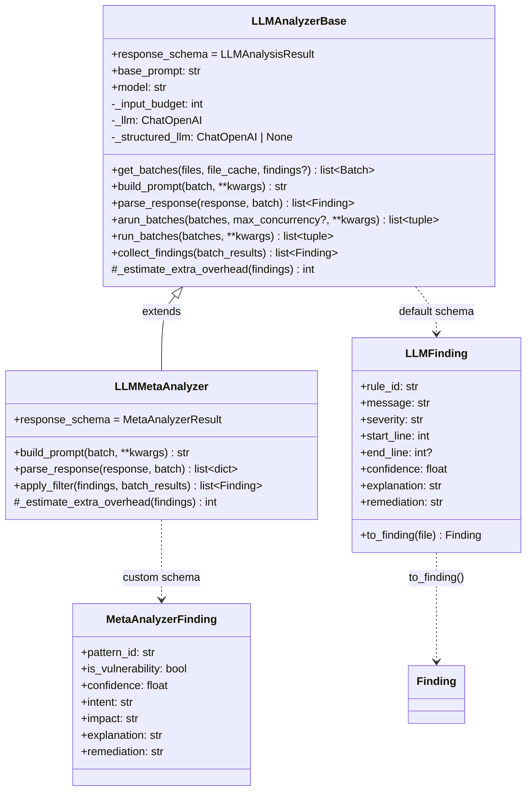
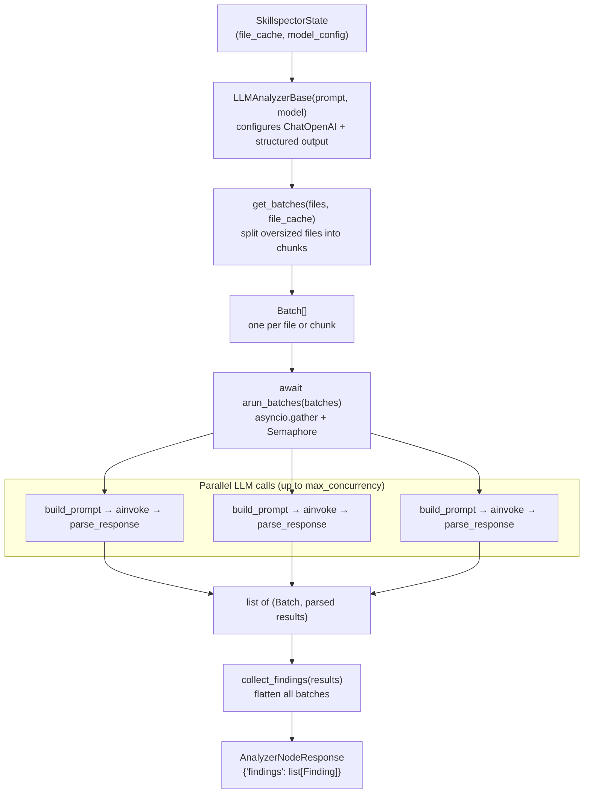
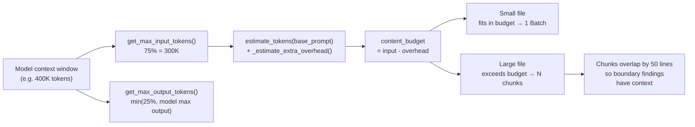
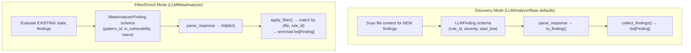
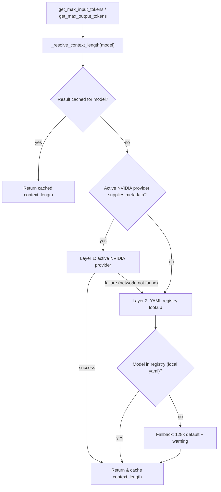

# LLM Analyzer Base — Developer Guide

How to build LLM-powered analyzer nodes using `LLMAnalyzerBase`.

## Overview

`LLMAnalyzerBase` (in `src/skillspector/llm_analyzer_base.py`) is a reusable
run-loop for LLM-powered analysis. It handles:

- **Parallel execution** — `arun_batches()` fires all LLM calls concurrently
  via `asyncio.gather`, with a configurable semaphore for rate limiting.  Both
  cross-file and cross-chunk batches are parallelized in a single gather call.
- **Token budgeting** — files are batched per the model's input window
- **Chunking** — oversized files are split with line-overlap so nothing is lost
- **Line-numbered prompts** — the LLM sees `L01:`, `L02:` prefixes and reports
  accurate `start_line` values
- **Structured output** — responses are validated via LangChain's
  `with_structured_output` and Pydantic schemas
- **Finding conversion** — `LLMFinding` objects convert directly to the graph
  state's `Finding` dataclass
- **Precision-over-recall default** — `BASE_ANALYSIS_PROMPT` appends output
  guidelines that instruct the LLM to prefer empty findings over false
  positives.  This applies automatically to all analyzers using the default
  `build_prompt()`.  Subclasses that override `build_prompt()` (e.g. the
  meta-analyzer) control their own output instructions.

A discovery-mode analyzer only needs to supply a **prompt string**. Everything
else — batching, prompt formatting, parallel LLM invocation, parsing, and
Finding creation — is provided by the base class.

---

## Quick Start — Minimal Analyzer

```python
"""Semantic security discovery analyzer node."""

from __future__ import annotations

from skillspector.constants import SKILLSPECTOR_DEFAULT_MODEL
from skillspector.llm_analyzer_base import LLMAnalyzerBase
from skillspector.logging_config import get_logger
from skillspector.state import AnalyzerNodeResponse, SkillspectorState

ANALYZER_ID = "semantic_security_discovery"
logger = get_logger(__name__)

ANALYZER_PROMPT = """\
You are a security analyst reviewing an AI agent skill.

Look for:
- Hardcoded credentials or API keys
- Shell injection (subprocess with shell=True, os.system)
- Data exfiltration (HTTP calls sending environment variables)
- Insecure file operations (writing to /etc, reading SSH keys)

Use rule IDs prefixed with "SSD-" (e.g. SSD-001, SSD-002).
"""


def node(state: SkillspectorState) -> AnalyzerNodeResponse:
    """Discover security findings via LLM analysis."""
    if state.get("use_llm", True) is False:
        return {"findings": []}

    file_cache: dict[str, str] = state.get("file_cache") or {}
    files = sorted(file_cache.keys())
    if not files:
        return {"findings": []}

    model_config = state.get("model_config") or {}
    model = (
        model_config.get(ANALYZER_ID)
        or model_config.get("default")
        or SKILLSPECTOR_DEFAULT_MODEL
    )

    try:
        import asyncio

        analyzer = LLMAnalyzerBase(base_prompt=ANALYZER_PROMPT, model=model)
        batches = analyzer.get_batches(files, file_cache)
        results = asyncio.run(analyzer.arun_batches(batches))
        findings = analyzer.collect_findings(results)
        logger.info("%s: %d findings", ANALYZER_ID, len(findings))
        return {"findings": findings}
    except ValueError:
        raise
    except Exception as e:
        logger.warning("%s failed: %s", ANALYZER_ID, e)
        return {"findings": []}
```

That's it. The node calls `asyncio.run(analyzer.arun_batches())` to run all
LLM calls in parallel while staying compatible with `graph.invoke()` (sync).
The base class provides `build_prompt`, `parse_response`, `arun_batches`,
and `collect_findings` out of the box.

> **Note:** A sync `run_batches()` method also exists for backward
> compatibility, but `arun_batches()` is the recommended path for all new
> analyzers.  For `async def` nodes (used with `graph.ainvoke()`), call
> `await analyzer.arun_batches()` directly instead of wrapping with
> `asyncio.run()`.

---

## What the LLM Sees

For a file `config.py` with 8 lines, the default `build_prompt` produces:

```
You are a security analyst reviewing an AI agent skill.

Look for:
- Hardcoded credentials or API keys
...

Analyze the following skill file for security issues matching the criteria above.
Reference line numbers (shown as L-prefixes) when reporting findings.

## File: config.py
```
L1: import os
L2:
L3: API_KEY = os.environ["API_KEY"]  # was hardcoded — the LLM would flag this
L4: DB_HOST = "db.example.test"
L5:
L6: def get_connection():
L7:     return connect(DB_HOST, api_key=API_KEY)
L8:
```
```

For a chunked file (e.g. lines 100-200 of a large file):

```
## File: big_skill.py (lines 100–200)
```
L100: def dangerous_function():
L101:     os.system(user_input)
...
```
```

The LLM's structured output (`LLMFinding.start_line`) maps directly to these
line numbers.

---

## What the LLM Returns

The default `response_schema` is `LLMAnalysisResult`, which the LLM fills via
`with_structured_output`:

```python
class LLMFinding(BaseModel):
    rule_id: str          # e.g. "SSD-001"
    message: str          # "Hardcoded API key"
    severity: Literal["LOW", "MEDIUM", "HIGH", "CRITICAL"]
    start_line: int       # references L-prefixed line numbers
    end_line: int | None  # optional range
    confidence: float     # 0.0–1.0
    explanation: str      # why this is a finding
    remediation: str      # how to fix it

class LLMAnalysisResult(BaseModel):
    findings: list[LLMFinding]
```

Each `LLMFinding` converts to a graph-state `Finding` via `to_finding(file)`:

```python
finding = llm_finding.to_finding("config.py")
# Finding(rule_id="SSD-001", message="Hardcoded API key",
#         severity="HIGH", file="config.py", start_line=3, ...)
```

---

## Data Flow

The pipeline for a discovery-mode analyzer:

```
State (file_cache, model_config)
  │
  ▼
get_batches(files, file_cache)
  │  splits oversized files into token-budget chunks
  ▼
[Batch, Batch, ...]           ← one per file (or per chunk)
  │
  ▼
await arun_batches(batches)
  │  asyncio.gather (parallel, up to max_concurrency):
  │    build_prompt(batch)    ← numbers lines, wraps with analyzer prompt
  │    _structured_llm.ainvoke(prompt)  ← async LangChain structured output
  │    parse_response(result, batch)    ← LLMFinding → Finding via to_finding()
  ▼
[(Batch, [Finding, ...]), ...]
  │
  ▼
collect_findings(results)
  │  flattens all batches
  ▼
list[Finding]  →  return {"findings": findings}
```

---

## Precision-Over-Recall Default

`BASE_ANALYSIS_PROMPT` appends output guidelines after the file content that
instruct the LLM to:

1. **Prefer empty findings** — most files are clean; an empty list is expected.
2. **Avoid false positives** — it is better to miss an edge case than to report
   a speculative issue.
3. **Be precise** — only report genuine issues the analyzer is confident about.

These guidelines apply automatically to every analyzer that uses the default
`build_prompt()`.  Individual analyzer prompts **do not need to repeat** these
instructions — they are inherited from the base template.

Analyzers that override `build_prompt()` (e.g. `LLMMetaAnalyzer`) are
responsible for their own output instructions and are not affected.

If a future analyzer specifically needs high-recall behavior (flag everything,
filter later), it should override `build_prompt()` and omit the guidelines.

---

## Customization Points

### Custom Prompt Only (Most Common)

Just pass a different `base_prompt` string. The default `build_prompt` wraps it
with line-numbered file content automatically.

```python
analyzer = LLMAnalyzerBase(
    base_prompt="Look for prompt injection patterns...",
    model=model,
)
```

### Custom Prompt Layout

Override `build_prompt` to control exactly what the LLM sees. The meta-analyzer
does this to inject metadata and static findings:

```python
class MyAnalyzer(LLMAnalyzerBase):
    def build_prompt(self, batch: Batch, **kwargs: object) -> str:
        context = kwargs.get("extra_context", "")
        numbered = number_lines(batch.content, batch.start_line)
        return f"""{self.base_prompt}

## Context
{context}

## {batch.file_label}
```
{numbered}
```"""
```

### Custom Response Schema

Override `response_schema` with a different Pydantic model and implement
`parse_response`. This is what the meta-analyzer does:

```python
from pydantic import BaseModel, Field
from typing import Literal

class MyFinding(BaseModel):
    pattern: str
    severity: Literal["LOW", "MEDIUM", "HIGH", "CRITICAL"]
    line: int
    reason: str

class MyResult(BaseModel):
    findings: list[MyFinding]

class MyAnalyzer(LLMAnalyzerBase):
    response_schema = MyResult

    def parse_response(self, response: MyResult, batch: Batch) -> list[Finding]:
        return [
            Finding(
                rule_id=f.pattern,
                message=f.reason,
                severity=f.severity,
                file=batch.file_path,
                start_line=f.line,
            )
            for f in response.findings
        ]
```

### Token Overhead for Extra Prompt Content

If your prompt includes variable-length content (like existing findings),
override `_estimate_extra_overhead` so the chunker reserves enough room:

```python
class MyAnalyzer(LLMAnalyzerBase):
    def _estimate_extra_overhead(self, findings: list[Finding]) -> int:
        if not findings:
            return 0
        text = format_my_findings(findings)
        return estimate_tokens(text)
```

---

## Key Classes and Functions

| Name | Location | Purpose |
|------|----------|---------|
| `LLMAnalyzerBase` | `llm_analyzer_base.py` | Base class — batching, prompting, LLM calls, parsing |
| `arun_batches()` | `llm_analyzer_base.py` | Async parallel batch execution with concurrency semaphore (recommended) |
| `run_batches()` | `llm_analyzer_base.py` | Sync sequential batch execution (backward compat) |
| `LLMFinding` | `llm_analyzer_base.py` | Default Pydantic schema for discovered findings |
| `LLMAnalysisResult` | `llm_analyzer_base.py` | Default structured output wrapper (`list[LLMFinding]`) |
| `Batch` | `llm_analyzer_base.py` | Dataclass — one file (or chunk) of work |
| `number_lines()` | `llm_analyzer_base.py` | Prefixes content with `L01:`, `L02:` line numbers |
| `BASE_ANALYSIS_PROMPT` | `llm_analyzer_base.py` | Template wrapping analyzer prompt + numbered content + precision-over-recall output guidelines |
| `estimate_tokens()` | `llm_analyzer_base.py` | Approximate token count (chars / 4) |
| `get_chat_model()` | `llm_utils.py` | Returns configured `ChatOpenAI` instance |
| `Finding` | `models.py` | Graph-state finding dataclass |
| `AnalyzerNodeResponse` | `state.py` | TypedDict: `{"findings": list[Finding]}` |

---

## Existing Implementations

### Meta-Analyzer (`LLMMetaAnalyzer`)

The meta-analyzer uses `LLMAnalyzerBase` in **filter/enrich mode** — it
evaluates *existing* static findings rather than discovering new ones:

- Overrides `response_schema` with `MetaAnalyzerResult` (has `pattern_id`,
  `is_vulnerability`, `intent`, `impact`)
- Overrides `build_prompt` to include metadata and static findings text
- Overrides `parse_response` to return dicts (not `Finding` objects)
- Adds `apply_filter` to match LLM results back to originals by `(file, rule_id)`

### Semantic Analyzers

These are implemented on top of `LLMAnalyzerBase` and emit findings only when `use_llm` is enabled:

| Analyzer | Purpose |
|----------|---------|
| `semantic_security_discovery` | Intent and attack-phrasing risks |
| `semantic_developer_intent` | Description-behavior mismatch |
| `semantic_quality_policy` | Quality/safety rubric violations |

---

## Testing

Mock `get_chat_model` to avoid real LLM calls.  Use `AsyncMock` for
`ainvoke` since `arun_batches` is async:

```python
from unittest.mock import AsyncMock, MagicMock, patch
from skillspector.llm_analyzer_base import LLMAnalyzerBase, LLMAnalysisResult, LLMFinding

MOCK_TARGET = "skillspector.llm_analyzer_base.get_chat_model"

def _mock_get_chat_model(*args, **kwargs):
    mock_llm = MagicMock()
    mock_llm.with_structured_output.return_value = MagicMock()
    return mock_llm

@patch(MOCK_TARGET, _mock_get_chat_model)
async def test_my_analyzer():
    analyzer = LLMAnalyzerBase(base_prompt="test prompt", model="openai/openai/gpt-5.2")

    # Mock ainvoke for the async parallel path
    analyzer._structured_llm.ainvoke = AsyncMock(
        return_value=LLMAnalysisResult(
            findings=[
                LLMFinding(
                    rule_id="TEST-001",
                    message="Test finding",
                    severity="HIGH",
                    start_line=5,
                    confidence=0.9,
                ),
            ],
        )
    )

    batches = analyzer.get_batches(["test.py"], {"test.py": "import os\nos.system('rm -rf /')"})
    results = await analyzer.arun_batches(batches)  # test async directly
    findings = analyzer.collect_findings(results)

    assert len(findings) == 1
    assert findings[0].rule_id == "TEST-001"
    assert findings[0].file == "test.py"
    assert findings[0].start_line == 5
```

> With `asyncio_mode = "auto"` in `pyproject.toml`, pytest-asyncio
> automatically runs `async def test_*` functions.

---

## Appendix A: Class Hierarchy



## Appendix B: Discovery-Mode Data Flow



## Appendix C: Token Budget and Chunking



## Appendix D: Meta-Analyzer vs Discovery Mode



## Appendix E: Layered Model Resolution and Open-Source Portability

### 1. Layered Resolution Approach

Every LLM call needs to know the model's token limits (context window size)
so prompts and chunks fit within budget.  Rather than hardcoding limits or
relying on a single metadata source, `model_info.py` resolves token limits
through a **layered fallback chain**:



| Layer | Activation | Description |
|-------|-----------|-------------|
| Layer 1 | The active NVIDIA provider in `src/skillspector/providers/` returns a non-`None` answer | Optional source of dynamic token limits; falls through silently when unavailable. |
| Layer 2 | `SKILLSPECTOR_MODEL_REGISTRY` env var is set | Looks up the model in the YAML file pointed to by the env var. A reference `model_registry.yaml` is included in the repo root. |
| Fallback | Neither layer resolved | Returns a conservative 128 000-token default and logs a warning prompting the user to add the model to the registry. |

Results are cached per model label for the lifetime of the process
(`@functools.cache`), so the resolution cost is paid at most once per model.

### 2. Open-Sourcing Plan

#### 2.1 Swappable Inference Endpoint

Skillspector's LLM inference is built on LangChain's `ChatOpenAI`, which
speaks the **OpenAI Chat Completions API**.  The base URL is configured via
`INFERENCE_API_BASE_URL` in `constants.py` and can be overridden per call
through `get_chat_model(base_url=...)` in `llm_utils.py`.

Any provider that implements the OpenAI completions schema works as a
drop-in replacement:

| Provider | Configuration |
|----------|---------------|
| OpenAI | `INFERENCE_API_BASE_URL=https://api.openai.com/v1` |
| Azure OpenAI | Set the Azure endpoint as `INFERENCE_API_BASE_URL` |
| vLLM | `INFERENCE_API_BASE_URL=http://localhost:8000/v1` |
| Ollama | `INFERENCE_API_BASE_URL=http://localhost:11434/v1` |
| LiteLLM proxy | `INFERENCE_API_BASE_URL=http://localhost:4000/v1` |

No code changes are required — only the environment variable (or a one-line
constant update) needs to change.

#### 2.2 Manual Specification of model_registry.yaml

For environments **without** access to the NVIDIA Inference Hub metadata
API (i.e. most open-source deployments), model token limits are provided
through a YAML registry file.

The registry is **not** bundled inside the pip package — since the tool is
designed to work with any OpenAI-compatible provider, the specific models
and their limits depend entirely on the user's environment.

**Reference file** — A pre-populated `model_registry.yaml` is included at
the repository root as a starting point.  Copy it, edit the models to match
your environment, and point the env var at it.

**File format:**

```yaml
models:
  "my-provider/model-name":
    context_length: 128000        # total context window in tokens (required)
    max_output_tokens: 16384      # model's max output cap (optional)
```

- `context_length` is required — the total context window in tokens.
- `max_output_tokens` is optional — when present, `get_max_output_tokens()`
  returns the smaller of the percentage-based budget (25 % of context) and
  this explicit cap.

**Activation** — Set the `SKILLSPECTOR_MODEL_REGISTRY` environment
variable to point at your registry file:

```bash
export SKILLSPECTOR_MODEL_REGISTRY=./model_registry.yaml
```

When this env var is unset, Layer 2 is inactive and resolution falls
through to the 128k default for any model not found via the metadata API.
